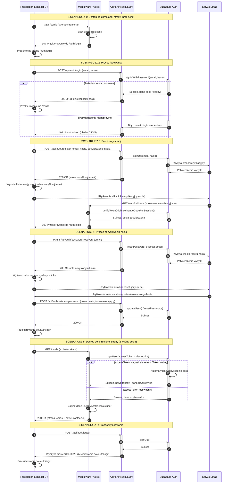

<authentication_analysis>
### 1. Przepływy Uwierzytelniania

Na podstawie dostarczonych dokumentów, zidentyfikowano następujące przepływy uwierzytelniania:

- **Dostęp do chronionej strony (niezalogowany):** Użytkownik próbuje uzyskać dostęp do strony wymagającej logowania (np. `/cards`). Middleware przechwytuje żądanie, stwierdza brak aktywnej sesji i przekierowuje użytkownika na stronę logowania (`/auth/login`).
- **Proces logowania użytkownika:** Użytkownik wypełnia formularz logowania w przeglądarce. Formularz wysyła żądanie `POST` do endpointu `/api/auth/login` w Astro. Endpoint komunikuje się z Supabase Auth w celu weryfikacji poświadczeń. Po pomyślnym zalogowaniu Supabase ustawia ciasteczka sesji, a API zwraca odpowiedź sukcesu. Przeglądarka przekierowuje użytkownika na stronę aplikacji (np. `/cards`).
- **Proces rejestracji użytkownika:** Użytkownik wypełnia formularz rejestracyjny w przeglądarce, który wysyła żądanie `POST` do `/api/auth/register`. Endpoint Astro wywołuje funkcję `signUp` w Supabase. Supabase wysyła e-mail weryfikacyjny. Po kliknięciu w link weryfikacyjny użytkownik trafia na `/auth/callback.astro`, który finalizuje proces i przekierowuje do logowania. Logowanie jest możliwe dopiero po potwierdzeniu adresu e-mail.
- **Proces odzyskiwania hasła:** Użytkownik, na stronie odzyskiwania hasła, podaje swój adres e-mail. Przeglądarka wysyła żądanie `POST` do `/api/auth/password-recovery`. Endpoint Astro wywołuje `supabase.auth.resetPasswordForEmail()`, a Supabase wysyła link do resetu hasła. Po kliknięciu w link, użytkownik jest kierowany na stronę, gdzie może ustawić nowe hasło, po czym może się zalogować.
- **Dostęp do chronionej strony (zalogowany):** Użytkownik z ważną sesją (ciasteczkami) żąda dostępu do chronionej strony. Middleware przechwytuje żądanie, weryfikuje tokeny z ciasteczek przy użyciu Supabase. Jeśli sesja jest ważna, middleware umieszcza dane użytkownika w `Astro.locals.user` i pozwala na kontynuację żądania do strony Astro.
- **Proces wylogowania:** Użytkownik klika przycisk wylogowania, co inicjuje żądanie `POST` do `/api/auth/logout`. Endpoint Astro wywołuje `signOut` w Supabase, co usuwa ciasteczka sesji. Użytkownik jest przekierowywany na stronę logowania.

### 2. Główni Aktorzy i Ich Interakcje

- **Przeglądarka (Browser/React):** Aktor inicjujący. Renderuje interfejs użytkownika (formularze logowania/rejestracji/odzyskiwania hasła) i wysyła żądania do Astro API. Komunikuje się z użytkownikiem i zarządza przekierowaniami po stronie klienta.
- **Middleware (Astro):** Centralny strażnik aplikacji. Przechwytuje *każde* żądanie. Odpowiada za ochronę tras (sprawdzanie, czy użytkownik jest zalogowany) i zarządzanie sesją na poziomie serwera poprzez odczyt i weryfikację ciasteczek.
- **Astro API (`/pages/api/auth/*`):** Backend dla frontendu (BFF). Obsługuje logikę biznesową uwierzytelniania (logowanie, rejestracja, wylogowanie, odzyskiwanie hasła). Działa jako pośrednik między przeglądarką a Supabase Auth, nigdy nie ujawniając kluczy serwisowych klientowi.
- **Supabase Auth:** Usługa zewnętrzna, która jest "źródłem prawdy" na temat tożsamości użytkownika. Zarządza bazą danych użytkowników, hasłami, wystawianiem i weryfikacją tokenów JWT (Access Token, Refresh Token) oraz obsługuje mechanizmy takie jak bezpieczne logowanie i wysyłanie e-maili.
- **Email Service (Serwis Email):** Odpowiedzialny za wysyłanie wiadomości e-mail w procesach rejestracji (potwierdzenie) i odzyskiwania hasła (link resetujący).

### 3. Proces Weryfikacji i Odświeżania Tokenów

- **Weryfikacja:** Przy każdym żądaniu do chronionej strony, Middleware Astro odczytuje `accessToken` i `refreshToken` z ciasteczek. Następnie używa serwerowego klienta Supabase do weryfikacji `accessToken`.
- **Odświeżanie:** Jeśli `accessToken` wygasł, ale `refreshToken` jest nadal ważny, serwerowy SDK Supabase automatycznie podejmie próbę odświeżenia sesji. Otrzyma nowy `accessToken` i `refreshToken` od Supabase Auth i zaktualizuje je w ciasteczkach odpowiedzi, która zostanie wysłana do przeglądarki. Cały proces jest przezroczysty dla użytkownika.
- **Wygaśnięcie sesji:** Jeśli zarówno `accessToken`, jak i `refreshToken` są nieważne, weryfikacja w middleware nie powiedzie się, a użytkownik zostanie przekierowany na stronę logowania.

### 4. Opis Kroków Autentykacji (Szczegóły)

1.  **Żądanie dostępu:** Użytkownik wpisuje w przeglądarce adres chronionej strony.
2.  **Przechwycenie przez Middleware:** Middleware Astro przechwytuje żądanie *przed* renderowaniem strony.
3.  **Sprawdzenie Ciasteczek:** Middleware sprawdza obecność ciasteczek sesji (`sb-access-token`, `sb-refresh-token`).
4.  **Logika warunkowa w Middleware:**
    - **Brak ciasteczek:** Przekierowanie (`307 Temporary Redirect`) do `/auth/login`. Koniec przepływu.
    - **Są ciasteczka:** Middleware używa `supabase.auth.getUser(accessToken)` do weryfikacji.
5.  **Weryfikacja w Supabase:**
    - **Tokeny nieważne:** Supabase zwraca błąd. Middleware przekierowuje do `/auth/login`.
    - **Access Token wygasł, Refresh Token ważny:** Supabase automatycznie odświeża tokeny i zwraca dane użytkownika. Middleware aktualizuje ciasteczka w odpowiedzi.
    - **Tokeny ważne:** Supabase zwraca dane użytkownika.
6.  **Zezwolenie na dostęp:** Middleware umieszcza dane użytkownika w `Astro.locals.user` i przekazuje żądanie dalej (`next()`).
7.  **Renderowanie strony:** Strona Astro jest renderowana na serwerze, mając dostęp do danych zalogowanego użytkownika poprzez `Astro.locals.user`, co pozwala na personalizację UI (np. wyświetlenie avatara w `TopNav`).
8.  **Odpowiedź do przeglądarki:** Wyrenderowana strona HTML (wraz z ewentualnie zaktualizowanymi ciasteczkami sesji) jest wysyłana do przeglądarki.
</authentication_analysis>
<mermaid_diagram>

</mermaid_diagram>