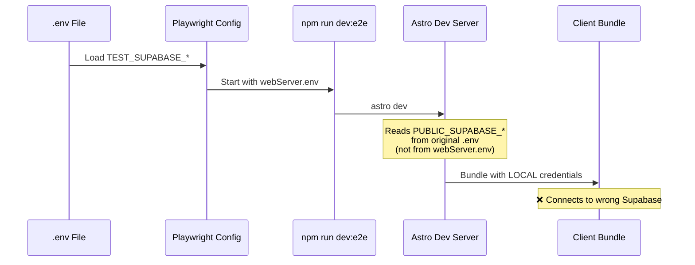
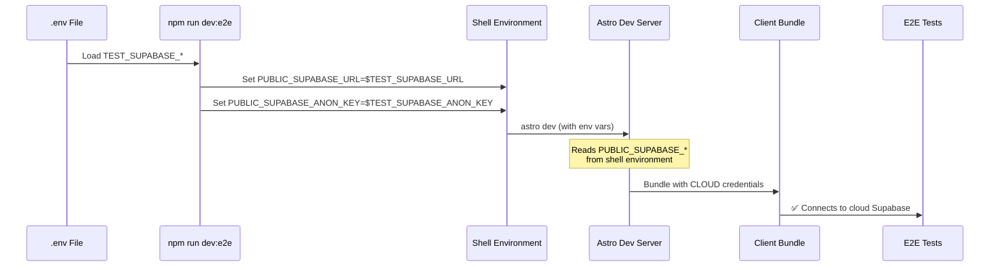
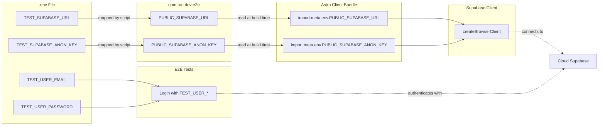
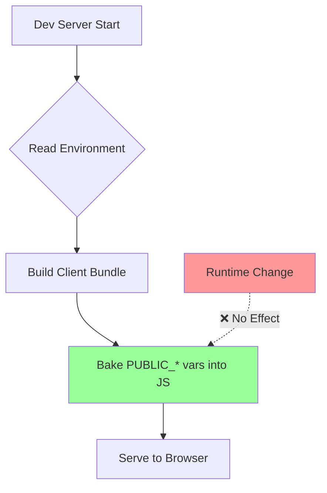
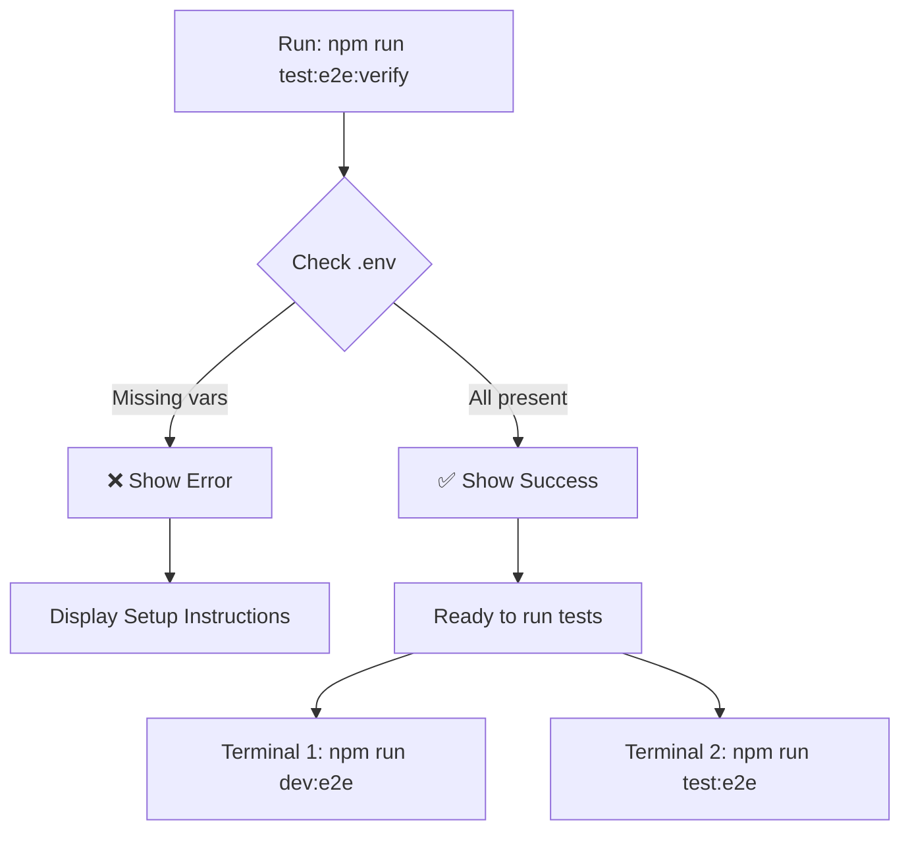

# E2E Environment Variables Flow

## Before Fix (Not Working)



**Problem:** The `webServer.env` in Playwright config only affects the Node.js process, not the Astro build process. Astro reads environment variables directly from the system environment at startup.

## After Fix (Working)



**Solution:** Set environment variables in the npm script **before** starting Astro, ensuring they're available in the shell environment when Astro reads them.

## Environment Variable Mapping



## Key Concepts

### 1. Astro Environment Variables

```typescript
// Server-side (any name)
const secret = import.meta.env.SECRET_KEY;

// Client-side (must have PUBLIC_ prefix)
const apiUrl = import.meta.env.PUBLIC_API_URL;
```

### 2. Build-time vs Runtime



**Important:** Client-side environment variables are **baked in** at build time. Changing them at runtime has no effect.

### 3. The Fix in Action

```bash
# ❌ Wrong: Sets env after Astro starts
astro dev
# (Astro already read PUBLIC_* from .env)

# ✅ Correct: Sets env before Astro starts
PUBLIC_SUPABASE_URL=$TEST_SUPABASE_URL astro dev
# (Astro reads PUBLIC_* from shell environment)
```

## Verification Flow



## Common Pitfalls

### Pitfall 1: Using webServer.env

```typescript
// ❌ Doesn't work for client-side code
webServer: {
  env: {
    PUBLIC_SUPABASE_URL: process.env.TEST_SUPABASE_URL
  }
}
```

**Why:** This only affects the Node.js process, not the Astro build.

### Pitfall 2: Changing env while server is running

```bash
# Terminal 1: Server running
npm run dev:e2e

# Terminal 2: Change .env
echo "TEST_SUPABASE_URL=new-url" >> .env

# ❌ No effect! Server must be restarted
```

**Why:** Environment variables are read once at startup.

### Pitfall 3: Forgetting PUBLIC_ prefix

```typescript
// ❌ Won't be available in browser
const url = import.meta.env.SUPABASE_URL;

// ✅ Correct
const url = import.meta.env.PUBLIC_SUPABASE_URL;
```

**Why:** Astro only exposes `PUBLIC_*` variables to client-side code.

