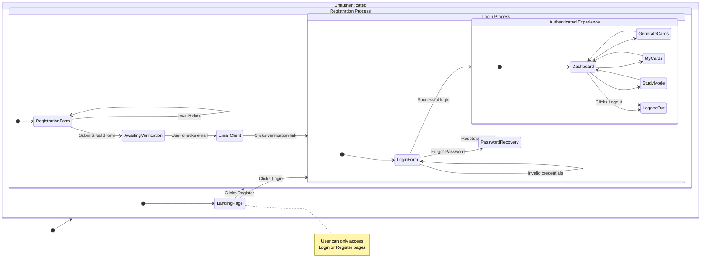

<user_journey_analysis>
### 1. User Paths

Based on the Product Requirements Document (PRD), the following user paths have been identified:

- **Unauthenticated User Access**: A new or logged-out user lands on the application. They are restricted to the authentication pages. If they attempt to access any protected page (e.g., `/cards`), they are redirected to the Login page.
- **Registration Path**: A new user decides to create an account.
    - They navigate to the Registration page.
    - They fill in and submit the registration form (email, password).
    - They are shown a message instructing them to verify their email address.
    - They click the verification link in their email.
    - Their account is activated, and they can now log in.
- **Login Path**: A registered user wants to access the application.
    - They navigate to the Login page.
    - They enter their credentials.
    - **Success**: If credentials are correct and the account is verified, they are granted access to the main application dashboard.
    - **Failure**: If credentials are incorrect, an error message is displayed, and they remain on the Login page.
- **Authenticated User Experience**: Once logged in, the user can access all core features of the application.
    - Generate flashcards from text.
    - Review, edit, and manage generated card candidates.
    - View and manage their collection of saved cards ("My Cards").
    - Use the "Study" mode.
- **Logout Path**: An authenticated user decides to end their session. They click a logout button, their session is terminated, and they are redirected to the Login page.

### 2. Main States and Purpose

- **Unauthenticated**: The initial state for any visitor. The goal is to funnel the user towards either logging in or registering. Access is limited.
- **Login**: The state where an existing user provides credentials to gain access.
- **Registration**: A multi-step state for a new user to create and activate their account. The goal is successful account creation.
- **Awaiting Email Verification**: A transient state after registration submission, where the user cannot log in until they have verified their email.
- **Authenticated (Dashboard)**: The main application state for a logged-in user. The goal is to allow access to all core product features (creating, managing, and studying flashcards).
- **Logged Out**: The final state after a user explicitly ends their session, returning them to the unauthenticated flow.

### 3. Decision Points and Alternative Paths

- **Initial Choice**: A new visitor must decide whether to `Login` or `Register`.
- **Login Credentials Check**: After submitting the login form, the system checks if credentials are valid. This is a key decision point leading to either the `Authenticated` state or an `Error Message` state.
- **Registration Form Validation**: The system validates the data provided during registration. If invalid, the user stays on the form with error messages.
- **Email Verification**: The user must leave the application to check their email and click the verification link. This is a critical step to transition from `Awaiting Email Verification` to being able to successfully log in.

</user_journey_analysis>
<mermaid_diagram>

</mermaid_diagram>
