<architecture_analysis>

### 1. Component and File List

Based on the provided documentation (`prd.md`, `auth-spec.md`) and a codebase analysis, the following elements are involved in the authentication process:

**Presentation Layer (UI):**

- **Astro Pages (`/src/pages`):**
  - `auth/login.astro`: Public page that renders the login form.
  - `auth/register.astro`: Public page that renders the registration form.
  - `auth/password-recovery.astro`: New page for password recovery.
  - `cards.astro`, `generate.astro`, etc.: Protected application pages.
- **Astro Layout (`/src/layouts`):**
  - `Layout.astro`: The main layout that will check the authentication state and pass it to child components like `TopNav`.
- **React Components (`/src/components`):**
  - `forms/LoginForm.tsx`: Interactive login form.
  - `forms/RegisterForm.tsx`: Interactive registration form.
  - `PasswordRecoveryForm.tsx`: New interactive form for password reset.
  - `TopNav.tsx`: Navigation component that must be updated to dynamically reflect the auth state (logged in/out).
  - `SignOutButton.tsx`: New component to handle the sign-out action.

**Business Logic Layer (Backend-for-Frontend):**

- **Astro Middleware (`/src/middleware/index.ts`):**
  - The central point for route protection. It intercepts every request, verifies the session, and decides whether to redirect or proceed.
- **Astro API Endpoints (`/src/pages/api/auth`):**
  - `login.ts`: Handles the server-side login logic.
  - `register.ts`: Handles the server-side registration logic.
  - `logout.ts`: Handles the server-side logout logic.
  - `password-recovery.ts`: Handles the password recovery logic.
- **Astro Callback (`/src/pages/auth/callback.astro`):**
  - A dedicated server-side endpoint to handle the user's return from Supabase after an email confirmation.

**Data and External Service Layer:**

- **Supabase Clients (`/src/db`):**
  - `supabase.client.ts`: The client-side client, used in React components.
  - `supabase.server.ts`: A new server-side client, used in middleware and API endpoints.
- **External Service:**
  - **Supabase Auth**: The external identity provider that manages users, sessions, and email sending.

### 2. Main Pages and Their Components

- The `/auth/login.astro` page renders the `<LoginForm />` component.
- The `/auth/register.astro` page renders the `<RegisterForm />` component.
- Every protected page (e.g., `/cards.astro`) is rendered within `Layout.astro`, which in turn uses `<TopNav />` to display the authentication status.

### 3. Data Flow

1.  **Login Flow:** User fills `LoginForm.tsx` -> `POST` to `/api/auth/login.ts` -> `login.ts` communicates with `Supabase Auth` -> `Supabase Auth` returns a `Set-Cookie` header -> `LoginForm.tsx` redirects to the main page.
2.  **Protected Route Access:** A request is made for a page (e.g., `/cards`) -> `middleware/index.ts` validates the cookie with `Supabase Auth` -> If the session is valid, the middleware places user data in `Astro.locals` -> `Layout.astro` retrieves data from `Astro.locals` and passes it to `TopNav.tsx`. If the session is invalid -> the `middleware` redirects to `/auth/login.astro`.
3.  **Logout Flow:** User clicks `SignOutButton.tsx` -> `POST` to `/api/auth/logout.ts` -> `logout.ts` communicates with `Supabase Auth` to invalidate the session/cookie -> `SignOutButton.tsx` redirects to the login page.

### 4. Component Functionality Description

- **`LoginForm` / `RegisterForm`**: Responsible for user interaction, client-side validation, and communication with the Astro API.
- **`middleware`**: The application's guard. Protects resources from unauthorized access.
- **API Endpoints**: Server-side proxies between the frontend and Supabase. They encapsulate the server-side authentication logic.
- **`Layout.astro` / `TopNav.tsx`**: Responsible for a consistent look and for dynamically displaying the auth state across all pages.
- **`Supabase Auth`**: The "brain" of the operation. It stores user data and manages sessions.

```mermaid
flowchart TD
    classDef updated fill:#E0BBE4,stroke:#333,stroke-width:2px;
    classDef new fill:#D2F8E0,stroke:#333,stroke-width:2px;
    classDef page fill:#C1E1FF,stroke:#2A6DA8,stroke-width:1px;
    classDef component fill:#FFF6C1,stroke:#A88D2A,stroke-width:1px;
    classDef api fill:#FFDDC1,stroke:#A8642A,stroke-width:1px;
    classDef external fill:#FFC1C1,stroke:#A82A2A,stroke-width:1px;

    subgraph "User (Browser)"
        direction LR
        User([User])

        subgraph "UI Components (React)"
            direction TB
            LoginForm(LoginForm.tsx):::component
            RegisterForm(RegisterForm.tsx):::component
            PasswordRecoveryForm(PasswordRecoveryForm.tsx):::new
            TopNav(TopNav.tsx):::updated
            SignOutButton(SignOutButton.tsx):::new
        end
    end

    subgraph "Astro Application (Server)"
        direction TB

        Middleware(middleware/index.ts):::new

        subgraph "Public Pages (.astro)"
            direction TB
            LoginPage["auth/login.astro"]:::page
            RegisterPage["auth/register.astro"]:::page
            CallbackPage["auth/callback.astro"]:::new
            PasswordRecoveryPage["auth/password-recovery.astro"]:::new
        end

        subgraph "API Endpoints (.ts)"
            direction TB
            ApiLogin["/api/auth/login"]:::api
            ApiRegister["/api/auth/register"]:::api
            ApiLogout["/api/auth/logout"]:::api
            ApiPasswordRecovery["/api/auth/password-recovery"]:::new
        end

        subgraph "Protected App Pages (.astro)"
            direction TB
            MainLayout(Layout.astro):::updated
            CardsPage["cards.astro"]:::page
            GeneratePage["generate.astro"]:::page

        end
    end

    subgraph "External Services"
        Supabase[Supabase Auth]:::external
        EmailService[Email Service]:::external
    end

    %% --- Main Connections ---
    User -- Interacts with --> LoginForm
    User -- Interacts with --> RegisterForm
    User -- Interacts with --> PasswordRecoveryForm
    User -- Clicks logout --> SignOutButton

    %% --- Page Access Flow ---
    User -- "1. Requests /cards" --> Middleware
    Middleware -- "2a. No Session -> Redirect" --> LoginPage
    Middleware -- "2b. Session OK -> Get User" --> MainLayout

    %% --- Page & Component Logic ---
    LoginPage -- Renders --> LoginForm
    RegisterPage -- Renders --> RegisterForm
    PasswordRecoveryPage -- Renders --> PasswordRecoveryForm
    MainLayout -- Passes user data to --> TopNav
    MainLayout -- Wraps --> CardsPage
    MainLayout -- Wraps --> GeneratePage
    TopNav -- Conditionally renders --> SignOutButton

    %% --- Login Flow ---
    LoginForm -- "3. Submits form (POST)" --> ApiLogin
    ApiLogin -- "4. Validate credentials" --> Supabase
    Supabase -- "5. Returns session (cookie)" --> ApiLogin
    ApiLogin -- "6. Returns 200 OK" --> LoginForm
    LoginForm -- "7. Redirects to /" --> User

    %% --- Registration Flow ---
    RegisterForm -- "POST" --> ApiRegister
    ApiRegister -- "Sign up user" --> Supabase
    Supabase -- "Sends confirmation email" --> EmailService
    EmailService -- "Confirmation link" --> User
    User -- "Clicks link, visits" --> CallbackPage
    CallbackPage -- "Verify token" --> Supabase
    Supabase -- "Confirms session" --> CallbackPage
    CallbackPage -- "Redirects to /auth/login" --> User

    %% --- Logout Flow ---
    SignOutButton -- "POST" --> ApiLogout
    ApiLogout -- "Invalidate session" --> Supabase
    ApiLogout -- "Returns 200 OK" --> SignOutButton
    SignOutButton -- "Redirects to /auth/login" --> User

    %% --- Password Reset Flow ---
    PasswordRecoveryForm -- "POST" --> ApiPasswordRecovery
    ApiPasswordRecovery -- "Request password reset for email" --> Supabase
    Supabase -- "Sends reset link" --> EmailService
```

  </architecture_analysis>

<mermaid_diagram>

</mermaid_diagram>
